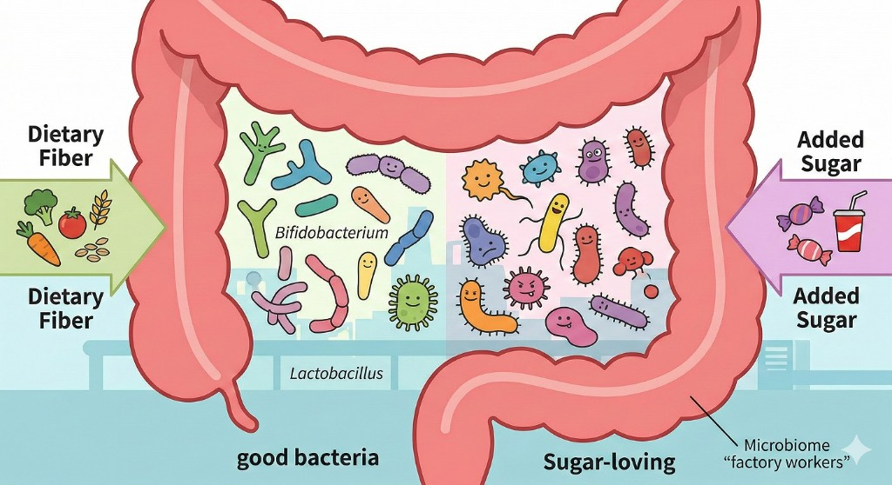
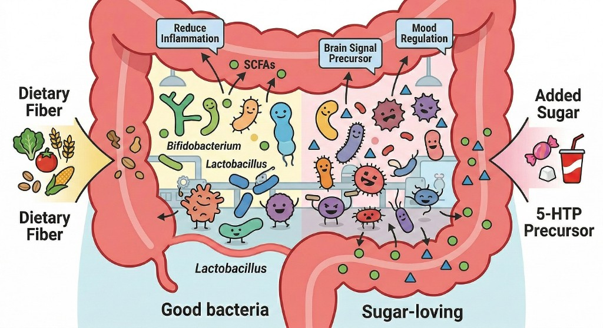
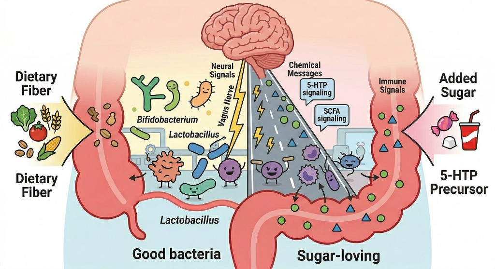

# CogniBiome Insights — Talking Story

**Created by:** Yana Evteeva | **Version:** 2026-03-01
**Audience:** General public, students, and science-fair judges (no biology or coding background required)

> **Disclaimer:** Educational hypothesis generator; not medical advice; not a diagnostic device.

---

## Module 1: The Hook — Food, Mood, and the Invisible Factory (0:00–2:30)

Imagine your body is a car. We all know that if you put terrible gas in a car, the engine sputters. But humans are much more complicated than cars.

Have you ever noticed that after eating a heavy, sugary breakfast, your brain feels foggy by 10:00 AM? But after a balanced meal with fiber, your focus stays sharp? We feel this happening, but if you ask a scientist: *"Exactly **how** does a bowl of oatmeal turn into better memory or faster logical reasoning?"* the answer involves a microscopic universe inside your gut.

That is the core of this project, **CogniBiome Insights**. It is an interactive "science calculator" built to explore the physical, biological pathway connecting the food on our plates to the performance of our brains.

Before we look at the math and the data, we need to understand the biology.

---

## Module 2: The Biology — The Gut–Brain Axis (2:30–6:00)

We need to define three big biological concepts. Think of them as three zooming camera shots: first we see the workers, then the messages they send, then the full highway those messages travel.

---

### Concept 1: The Microbiome — The Factory Workers

Your large intestine is home to trillions of microorganisms — bacteria, fungi, and other tiny life forms. Collectively, this community is called your **microbiome**. Think of it as a factory with two very different crews of workers, divided by what fuel they are given.

**The left side of the factory (Good Bacteria):** When you eat dietary fiber from vegetables, legumes, and whole grains, bacteria like *Bifidobacterium* and *Lactobacillus* thrive. These are the "skilled workers" — they are organized, productive, and do beneficial things.

**The right side of the factory (Sugar-Loving Bacteria):** When you eat a lot of added sugar, a different population of microbes proliferates. These "sugar-loving" workers crowd out the good bacteria and produce different, less beneficial outputs.

The balance between these two crews is what the first stage of the CogniBiome simulator models.

*Figure 1. The large intestine microbiome. Left (green zone): fiber-fed good bacteria (*Bifidobacterium*, *Lactobacillus*) — the "factory workers." Right (pink zone): sugar-loving microbial populations that proliferate with high added-sugar diets. Created by Yana Evteeva.*

---

### Concept 2: Metabolites — The Text Messages

Looking at the bacteria from Concept 1 only tells us *who* the workers are. The more important question is: *what do they produce?*

The answer is **metabolites** — small chemical molecules that the gut bacteria manufacture as byproducts of digesting your food. These are the "text messages" that the gut sends to the rest of the body, including the brain.

When the good bacteria from Concept 1 ferment dietary fiber, they generate a family of molecules called **Short-Chain Fatty Acids (SCFAs)** — acetate, propionate, and butyrate. These molecules have measurable functional effects:

- **Reduce Inflammation** — butyrate in particular has anti-inflammatory properties that can affect the blood-brain barrier.
- **Brain Signal Precursors** — certain gut bacteria influence tryptophan metabolism, producing precursors to serotonin (the 5-HTP pathway).
- **Mood Regulation** — GABA, an inhibitory neurotransmitter, is also produced by specific microbial strains.

When the sugar-loving workers dominate (right side of Concept 1), this chemical output shifts — fewer SCFAs, more pro-inflammatory signals. The "text messages" change tone entirely.

*Figure 2. Metabolite production in the gut. Left (yellow zone): good bacteria produce SCFAs (green dots) with functional labels — Reduce Inflammation, Brain Signal Precursor, Mood Regulation. Right (pink zone): sugar-loving microbes shift the chemical output toward pro-inflammatory signals. These are the "text messages" stage X→M in the D→X→M→Y pipeline. Created by Yana Evteeva.*

---

### Concept 3: The Gut–Brain Axis — The Communication Highway

We now know *who* the workers are (Concept 1) and *what messages they send* (Concept 2). Concept 3 zooms out to reveal *how those messages physically travel* from the gut to the brain.

The answer is the **Gut–Brain Axis** — a massive, multi-lane biological communication highway linking two organs that most people think of as completely separate.

This highway has three distinct signaling systems working in parallel:

- **Neural Signals (Vagus Nerve):** The vagus nerve is a direct electrical cable running from the gut to the brainstem. Gut bacteria can stimulate vagus nerve endings, sending neural signals directly upward.
- **Chemical Messages:** The metabolites from Concept 2 (SCFAs, 5-HTP precursors) enter the bloodstream and can cross or influence the blood-brain barrier, delivering their chemical signals to the brain.
- **Immune Signals:** The gut is home to a large fraction of the body's immune cells. Inflammatory signals triggered by microbial imbalance can travel systemically and affect neuroinflammation.

All three lanes are operating simultaneously, which is why this axis has such broad effects on mood, cognition, and mental health — and why it is so difficult to study experimentally.

*Figure 3. The Gut–Brain Axis. The full-body communication network: Neural Signals (Vagus Nerve), Chemical Messages (SCFAs and 5-HTP signaling from Concept 2), and Immune Signals travel from the gut (bottom, populated by the microbiome from Concept 1) to the brain (top). This is the complete D→X→M→Y pathway shown at the systems biology level. Created by Yana Evteeva.*

---

## Module 3: The Data Problem & The "Proxy" Solution (6:00–9:00)

If this biology is known, why don't we have an app that perfectly explains your test scores based on your breakfast?

Because of **The Measurement Problem**. To demonstrate this rigorously, a scientist would need to take a large group of teenagers and simultaneously measure:

1. Everything they eat
2. A DNA sequence of their gut microbiome
3. A blood test for their metabolites
4. Their scores on a rigorous cognitive test

Finding a dataset that has *all four* of these things measured in the same healthy teenagers at the same time is practically impossible right now.

### The Solution: Proxies — The Stunt Doubles

Because we cannot measure everything, CogniBiome uses **Proxies**. A proxy is an educated, mathematical stand-in for a missing piece of data.

**Analogy:** Imagine a movie star refuses to do a dangerous jump. The director uses a stunt double. The stunt double is not the real actor, but they represent the actor so the movie can move forward. In this app, our microbiome and metabolite numbers are "stunt doubles" — mathematical estimates based on published science, rather than physical blood tests from the users.

---

## Module 4: The Real Evidence — The Pilot Dataset (9:00–12:30)

To anchor this project in reality, we started with real humans. I collected a pilot dataset of 66 high school teenagers (**n = 66**).

Each teen completed a diet quality survey and four cognitive tests:

- **Stroop Test** — measures mental speed and attention
- **Memory Recall**
- **Language Test**
- **Logical Reasoning**

### Understanding Statistics: Correlation vs. Causation

We looked for a **correlation** — do these numbers move together? We measure this using **Pearson r**, which scores relationships from −1 to +1.

**Analogy:** Ice cream sales and sunburns have a high positive correlation — they go up together. But eating ice cream does not *cause* sunburns. Summer heat causes both. Correlation is a powerful clue, but it is not a conviction.

### The Findings

In our real teens, Diet Score had a moderate positive correlation with Overall Cognitive Score (r = 0.367, approximate p ≈ 0.003). Looking closer:

- **Language** and **Logical Reasoning** showed meaningful positive links.
- **Stroop** and **Memory** showed almost no link at all.

A low p-value means: *"If diet actually had zero relationship to cognition, the odds of seeing this pattern by pure random luck are very, very low."*

---

## Module 5: The Simulator — The D→X→M→Y Pipeline (12:30–16:00)

We have real data showing Diet and Cognition are linked. But *how*? To explore the "hidden middle," I engineered the CogniBiome Simulator.

It uses a transparent, four-stage computational pipeline: **D → X → M → Y**.

- **Stage D — Diet Inputs:** The user adjusts sliders for Fiber, Added Sugar, Saturated Fat, and Omega-3s.
- **Stage X — Microbiome (The Factory):** The app calculates how the diet shifts the bacterial balance. Fiber boosts *Bifidobacterium*, while high sugar throws off the balance. *(This is Concept 1 from Module 2.)*
- **Stage M — Metabolite Proxies (The Messages):** The new bacterial workforce produces different outputs — mathematically estimated rises in SCFAs (acetate, butyrate) and neurotransmitter precursors (5-HTP). *(This is Concept 2 from Module 2.)*
- **Stage Y — Cognition (The Result):** Those chemical signals are translated into estimated shifts in our four cognitive domains. *(This is the end of the highway from Concept 3.)*

This is not magic AI. It is a **Deterministic Simulator**.

**Analogy:** It acts exactly like a pocket calculator. 2 + 2 always equals 4. If you input the exact same diet sliders, the math will always produce the exact same cognitive output. There are no hidden random variables.

---

## Module 6: Trust, Rigor, and "Offline-First" (16:00–18:30)

In modern science, if your work cannot be reproduced by someone else, it is not science.

### The Run Hash — The Digital Receipt

To confirm the app is deterministic, every simulation generates a **SHA-256 Run Hash** — a unique cryptographic fingerprint. If a judge runs a scenario and gets hash `8e5f1b2c…`, another student anywhere in the world can input the same values and get the exact same hash, confirming the results are identical.

### Offline-First & Reference Snapshots

To build the math for the simulator, the app bundles data from major scientific databases:

- **USDA FDC** — tells us exactly what nutrients are in what foods.
- **MiMeDB (Microbial Metabolome Database)** — a reference dictionary mapping which bacteria produce which metabolites (used as evidence context; microbe↔metabolite links are literature-derived, not from a confirmed join table).
- **Reactome** — maps the biological pathways in the human body.

This app is an **Offline-First PWA** (Progressive Web App). It does not connect to the internet during a presentation. It uses pre-packaged "snapshots" of these databases, ensuring total privacy and flawless operation even without Wi-Fi.

---

## Module 7: Limitations and The Future (18:30–20:00)

A good scientist knows the limits of their tools.

1. **Frozen Artifacts:** Right now, the mathematical rules connecting pipeline stages are "frozen demo placeholders." They are based on biological logic, but they are not yet trained by a machine learning model on paired data.
2. **The Future Plan:** A Python backend will train these models stage-by-stage on paired public datasets — ZOE PREDICT for diet-to-microbiome, iHMP/IBDMDB for microbiome-to-metabolite — and swap the resulting artifact files into the app without code changes.

### Conclusion

CogniBiome Insights takes one of the most complex frontiers in human biology — the gut–brain axis — and makes it explorable and transparent.

By keeping real measured data separate from modeled biological proxies, and wrapping everything in a strictly reproducible, deterministic simulator, this project demonstrates that we can investigate complex multi-layer biological hypotheses honestly, rigorously, and accessibly — and that many similar problems become tractable in principle with sufficient paired data and proper workflow.

Thank you.
