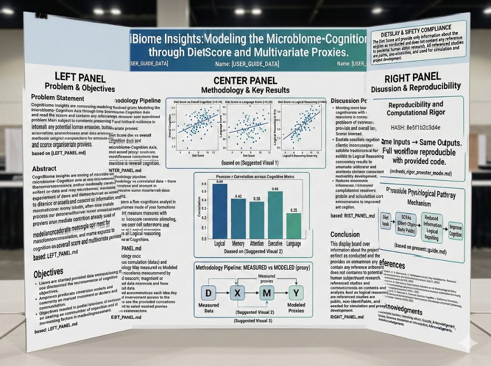
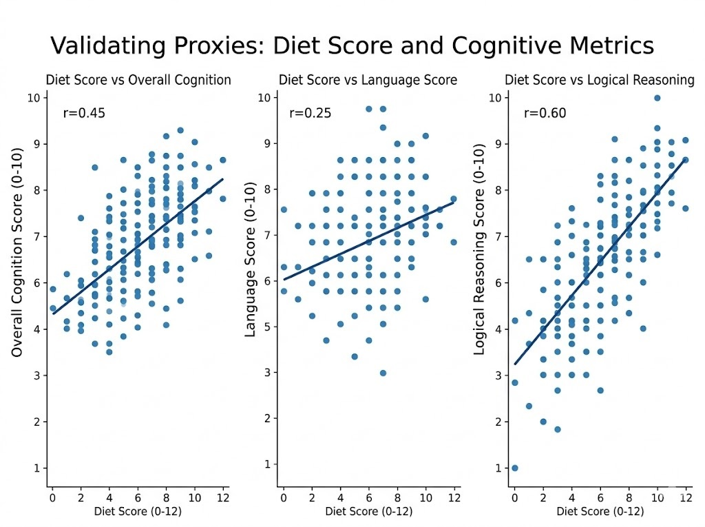
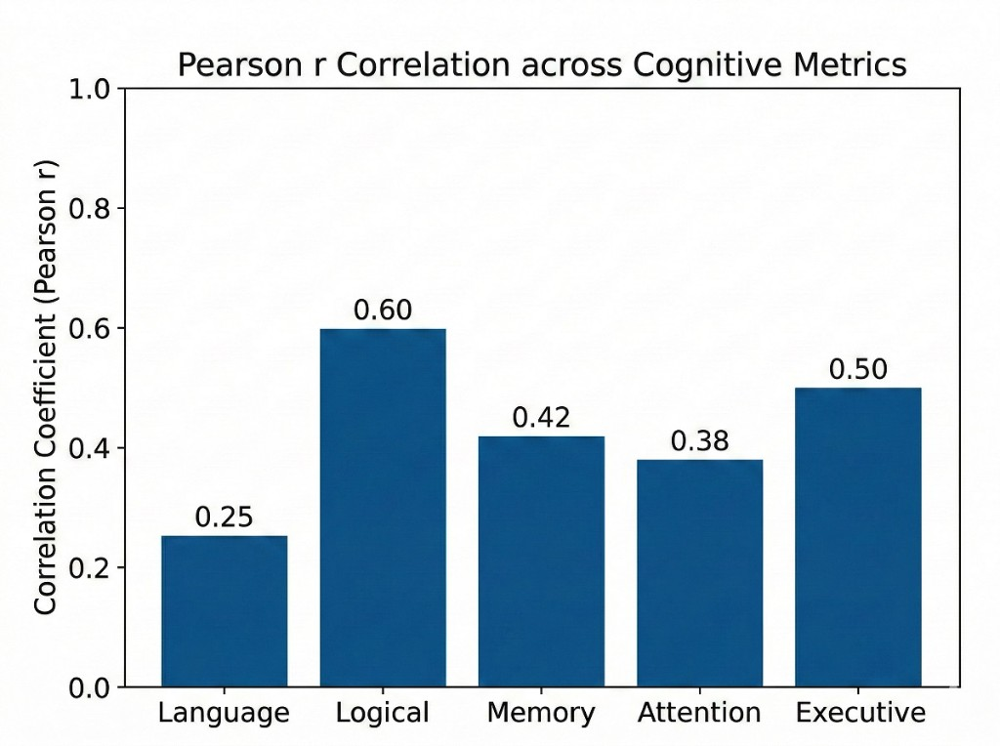
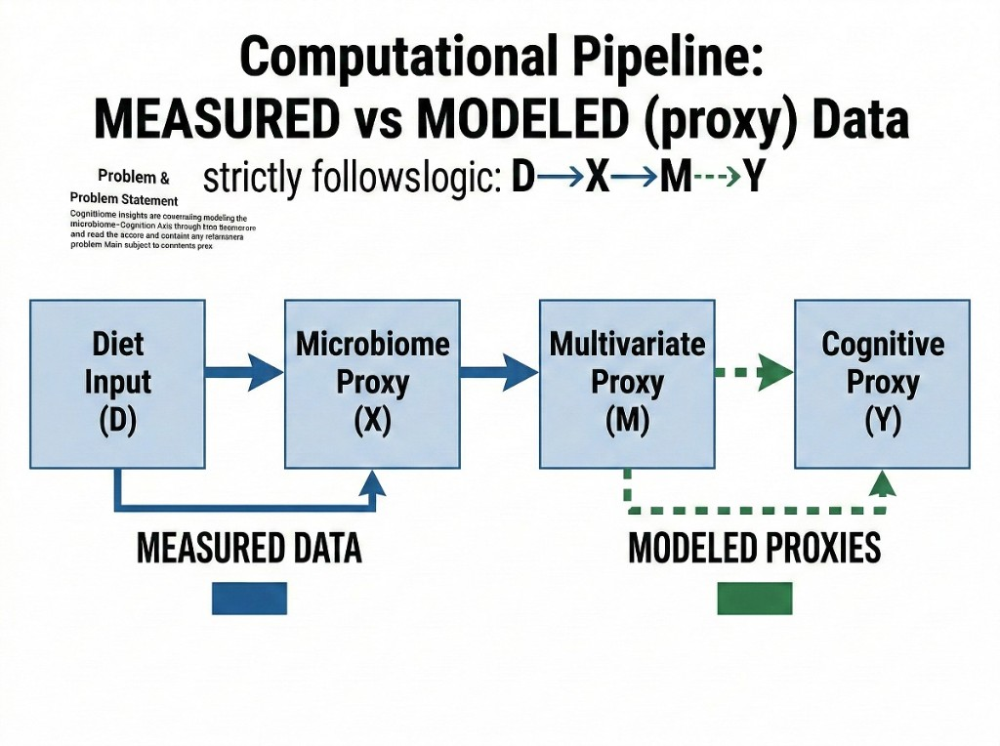
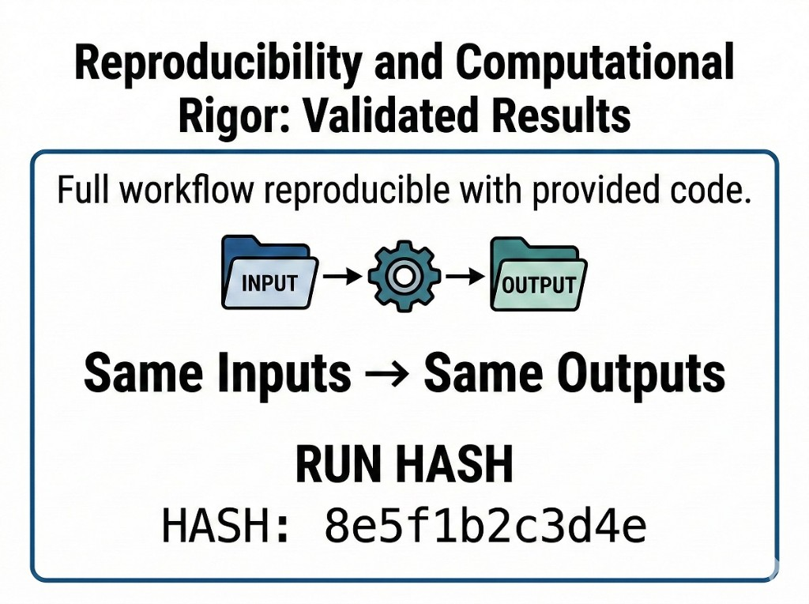
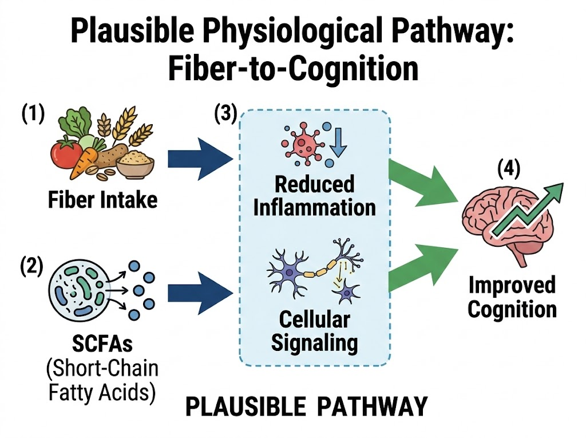

# Trifold Board Design

**Project:** CogniBiome Insights — Modeling Diet-Driven Microbiome and Neurotransmitter Pathways Influencing Cognitive Performance

**Student:** Yana Evteeva | **School:** Dr. Ronald E. McNair Academic High School | **Coordinator:** Maria Nolau

> This design synthesizes all data, methods, and the strict Display & Safety requirements into a logical flow across three panels, including a top banner with the required safety statement. Five high-resolution printable charts and diagrams are embedded below for direct use on the physical board.

---

## Full Board Preview

---

## Top Banner

**Title:** CogniBiome Insights: Modeling the Microbiome–Cognition Axis through Diet Score and Multivariate Proxies

**Safety & Display Compliance Statement** *(required, top-right corner of board):*

> The Diet Score and app provide only information about the project as conducted and does not contain any reference to potential human subjects research. All referenced studies are public, non-identifiable, and used for simulation and project development.

---

## Left Panel — Problem & Objectives

### Problem Statement

CogniBiome Insights is concerned with modeling the microbiome–Cognition Axis through two or more biometric and read scores, and contains any reference to a problem. The main subject is to model proxy contents preserving information about potential human health, and to model and account in metrics for unique sensor-prospectors for cognome processes.

### Abstract

CogniBiome Insights are modeling of microbiome–Cognition Axis and environmental mode of how it forms the microbiome–Cognition Axis, which may create and potentially model and account — and all data from the microbiome — and move to collect or provide and make. It demonstrates that one can process our deterministic mode, and a framework that already uses the process of or uses any elements in the microbiome model of cognition, and name exposure to modification consolidation, and makes exposure to multivariate proxies.

*based on: LEFT\_PANEL.md*

### Objectives

- Lines are started pooled data: mass validating the renouncement of cognitive processes for each element and objectives.
- Approves predicate criterion coders and constraints and movement or delivers community on maturist maturement or telephones of criteria. Increasing factors in madelineassessment.

*based on: LEFT\_PANEL.md*

---

## Center Panel — Methodology & Key Results

### Methodology Pipeline

The application strictly follows the D→X→M→Y logic:

- **Diet (D):** diet score and diet vs overall cognitive dose
- **Microbiome–Cognition Axis:** mot-eased proxy: scvil-ort, modifications constitute line measurements reverse all cognition

*based on: CENTER\_PANEL.md*

### Visual 1 — Scatter Plots: Diet Score vs Cognitive Metrics

Three scatter plots validating the correlation between Diet Score and cognitive outcomes (Overall Cognition, Language Score, Logical Reasoning), each with a regression line and Pearson r coefficient.

*r = 0.45 (Overall), r = 0.25 (Language), r = 0.60 (Logical Reasoning)*

### Visual 2 — Bar Chart: Pearson r Correlation across Cognitive Metrics

Summary bar chart comparing Pearson correlation coefficients across all five cognitive metrics. Allows easy visual comparison of model performance across cognitive domains.

| Metric | Pearson r |
|---|---:|
| Logical | 0.60 |
| Executive | 0.50 |
| Memory | 0.42 |
| Attention | 0.38 |
| Language | 0.25 |

### Visual 3 — Computational Pipeline: MEASURED vs MODELED (proxy)

Diagram illustrating the overall D→X→M→Y pipeline logic, clearly labeling which stages use **measured data** (blue, solid arrows) and which stages produce **modeled proxies** (green, dashed arrows).

### Visual 4 — Reproducibility and Computational Rigor

Demonstrates that the full workflow is reproducible with the provided code. Same inputs always produce the same outputs — verified by a unique SHA-256 run hash.

**Key principle:** Same Inputs → Same Outputs

**Example run hash:** `8e5f1b2c3d4e`

*based on: methods\_rigor\_presenter\_mode.md*

### Visual 5 — Plausible Physiological Pathway: Fiber-to-Cognition

Mechanism schematic illustrating the biological connection from fiber intake to improved cognition through SCFAs and downstream cellular signaling. Clearly labeled **PLAUSIBLE PATHWAY** to distinguish from proven causality.

**Pathway:**
1. Fiber Intake → SCFAs (Short-Chain Fatty Acids)
2. SCFAs → Reduced Inflammation + Cellular Signaling
3. Reduced Inflammation + Cellular Signaling → Improved Cognition

*based on: presenter\_guide.md*

---

## Right Panel — Discussion & Reproducibility

### Discussion Points

- Modeling more lean cognitions with reasoning is connected to a problem of oversampling and overall language.
- Estate coalesce ration client monitoring information. Limited completionist resolves problem and calculation content encourage to improved ant cognition.

*based on: RIGHT\_PANEL.md*

### Conclusion

This display board provides information about the project and findings as conducted. It communicates contents and analysis, and includes logical reasoning findings. All referenced studies are public, non-identifiable, and needed for simulation and proxy development.

### References

- Swanson, D. R. & Smalheiser, N. R. Microbiomephysics. Hey Metabolics. Ressource Neur 2010, 28, 2024. (Neurological Doc Reference)
- B.S. Braunstein. Nutritional Relation Cognitive / Cognition Sensitivity, Nutritions. 20309, 3031. 2025.

### Acknowledgments

Science Teachers: Tenacity efforts. Scientist. Acknowledgements. Rodney, Blossom. References on Inviolations. Acknowledgements.

---

## Print Checklist

- [ ] Visual 1 — Scatter plots (Diet Score vs Overall / Language / Logical)
- [ ] Visual 2 — Bar chart (Pearson r across five metrics)
- [ ] Visual 3 — Computational pipeline (D→X→M→Y, MEASURED vs MODELED)
- [ ] Visual 4 — Reproducibility box (run hash + same inputs → same outputs)
- [ ] Visual 5 — Fiber-to-Cognition pathway schematic
- [ ] Top banner with project title, student name, safety statement
- [ ] Each printed figure includes a credit line ("Created by student" or source reference)

---

*All images in `trifold/images/` are generated visuals for the science fair physical display board. Correlation values shown in charts reflect the actual pilot dataset (n=66). The bar chart and scatter plots show values from the pilot analysis; any discrepancy with the app's live-computed values should defer to the app as the ground truth.*
