# CogniBiome Insights — User Guide

**Version:** 2.0 — March 2026
**Audience:** Science fair judges, educators, reviewers, and new users

> **Important disclaimer:**
> CogniBiome Insights is an **educational research prototype**. It is NOT medical advice and NOT a diagnostic device. The simulator generates testable hypotheses — it does not prove causality or mechanism.

---

## Table of Contents

1. [Project Positioning](#project-positioning)
2. [What This Version Does and Does Not Claim](#what-this-version-does-and-does-not-claim)
3. [Overview & Application Architecture](#1-overview-application-architecture)
4. [Presenter Mode](#2-presenter-mode)
5. [Dashboard](#3-dashboard)
6. [Pilot Results](#4-pilot-results)
7. [Simulator](#5-simulator)
8. [Methods & Rigor](#6-methods-rigor)
9. [Compare Scenarios](#7-compare-scenarios)
10. [Export Report](#8-export-report)
11. [Help / Docs](#9-help-docs)

---

## Project Positioning

**What CogniBiome Insights is:**
CogniBiome Insights is an **educational simulator** demonstrating a rigorous, staged modeling
workflow for diet → gut biology → cognition problems. The primary contribution is the
**reproducible D → X → M → Y framework** and documentation of how one would solve the full
problem with larger paired datasets and sufficient compute.

**On "offline-first":**
Offline-first is a **science-fair presentation constraint** — the app must work reliably without
internet during judging. It is not a research objective.

**On the teen pilot (n=66):**
The pilot provides **real measured association results** (diet score vs four cognitive tasks).
It does not measure biological intermediates (no microbiome, no metabolomics). The association
signal motivates the modeling framework but does not establish a mechanism.

**On microbiome and metabolite layers:**
These are **modeled proxies** built from frozen demo coefficients — used to teach mechanism and
enable "what-if" exploration, not to claim measured biological data.

**On the research goal:**
Diet–cognition association is used as a **deliberately challenging case study** to build and
demonstrate a correct end-to-end scientific workflow. Many similar multi-layer biology problems
**become tractable in principle** with sufficient paired data and proper workflow — this project
demonstrates that workflow.

---

## What This Version Does and Does Not Claim

**DOES:**
- Demonstrates deterministic simulation runs with SHA-256 run hash and reproducible exports
- Teaches core concepts: correlation, confounding, proxy variables, mechanistic reasoning
- Allows side-by-side scenario comparison for learning
- Clearly labels all intermediate outputs as **MODELED PROXY**
- Separates real measured pilot evidence from modeled proxy layers

**DOES NOT:**
- Prove causality between diet and cognition
- Diagnose or predict individual health outcomes
- Claim microbiome or metabolites were measured in the teen pilot
- Claim final population-level effect sizes
- Assert the simulator coefficients are trained on any real paired dataset in this build

---

## 1. Overview & Application Architecture

CogniBiome Insights models the pathway from diet to cognitive performance through two complementary systems:

**Real data (Pilot Results):** A de-identified cohort of 66 teenagers with measured diet scores and cognitive test results. Statistical correlations are computed live from the CSV — nothing is pre-computed or synthetic.

**Modeled pipeline (Simulator):** A deterministic three-stage pipeline that estimates how dietary inputs propagate through the microbiome and metabolite layers to produce cognitive outcome proxies. All intermediate outputs are clearly labeled as **MODELED PROXY** — they are not biomarker measurements.

### The Three-Stage Pipeline

```
D → X → M → Y
```

| Stage | Full name | Inputs | Outputs |
|---|---|---|---|
| D→X | Diet → Microbiome | Fiber, Added Sugar, Saturated Fat, Omega-3 | Bifidobacterium, Lactobacillus, F:B Ratio |
| X→M | Microbiome → Metabolites | Microbiome proxies | Acetate, Propionate, Butyrate, 5-HTP Index |
| M→Y | Metabolites → Cognition | Metabolite proxies | Stroop, Language, Memory, Logical Reasoning, Overall Score |

> **Current build (v0.1):** All three stages use **frozen demo coefficients (UNPAIRED)**. They are directional placeholders — not trained on any paired cohort. Future phases target training on paired multi-omics datasets (ZOE PREDICT, iHMP/IBDMDB).

### Measured vs Modeled — at a glance

| What you see in the app | Is it measured or modeled? |
|---|---|
| Pilot Results scatter plots, correlations, summary stats | **Measured** — computed live from the real pilot CSV |
| Simulator microbiome outputs | **Modeled proxy** — frozen demo coefficients |
| Simulator metabolite outputs | **Modeled proxy** — frozen demo coefficients |
| Simulator cognitive domain outputs | **Modeled proxy** — frozen demo coefficients |
| NHANES reference ranges panel | **UI reference context only** — does not affect model math |

---

## 2. Presenter Mode

Presenter Mode is a special UI state designed for live demonstrations to judges and reviewers. It simplifies the interface to focus attention on the most scientifically critical elements.

### How to activate

Click the **"Presenter"** button in the top navigation bar. It changes to **"Presenter ON"** and a **"PRESENTER MODE"** badge appears under the version badge in the sidebar header.

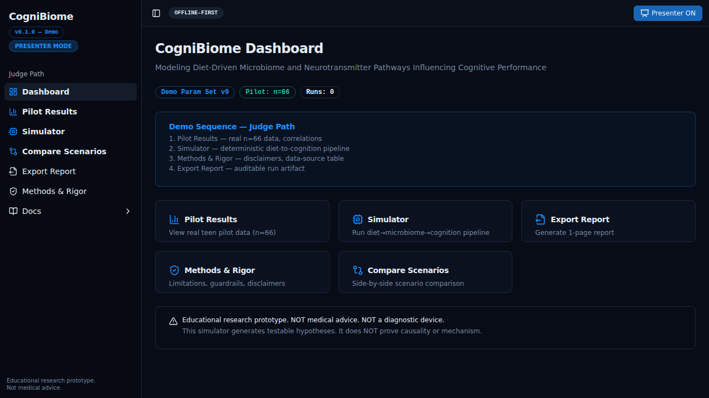

### What changes in Presenter Mode

| UI element | Normal mode | Presenter Mode |
|---|---|---|
| Sidebar navigation | All 7 screens visible | Judge-path screens only (Dashboard, Pilot, Simulator, Compare, Methods, Export) |
| Docs sidebar | All categories | User Docs only, no section headers, compact list |
| Dashboard | Standard layout | Adds "Demo Sequence — Judge Path" card with ordered steps |
| Pilot Results | All correlations equal weight | Key metrics highlighted with "Mention in speech" badge |
| Simulator inputs | Sliders + NHANES reference panel | Sliders only; reference panel and descriptions hidden |
| Methods & Rigor | Standard layout | Limitations card highlighted with ring; "Presenter cue" badge shown |
| Reset button | Visible | Hidden (to keep judge path clean) |

### The REAL DATA badge

Appears in **Pilot Results**. It confirms the data shown is genuine:

```
REAL DATA (de-identified teen pilot, n=66) • computed live from CSV • no synthetic points
```

### The MODELED PROXY badge

Appears next to every simulator output section header (Microbiome, Metabolites, Cognition). It communicates clearly that these values are **model estimates**, not measurements taken from participants.

---

## 3. Dashboard

The Dashboard is the entry point and orientation screen. It provides a high-level status overview and navigation to all major sections.


### Status badges

Three badges appear at the top of the page:

- **Demo Param Set v0** — current simulator uses v0 frozen demo coefficients
- **Pilot: n=66** — bundled pilot dataset is loaded
- **Runs: N** — number of simulation runs saved in the current session

### Judge Path card (Presenter Mode only)

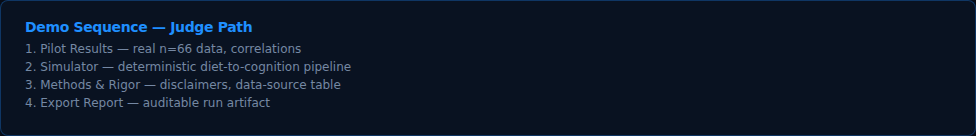

When Presenter Mode is active, a highlighted card lists the recommended judge walkthrough sequence:

1. Pilot Results — real n=66 data, correlations
2. Simulator — deterministic diet-to-cognition pipeline
3. Methods & Rigor — disclaimers, data-source table
4. Export Report — auditable run artifact

### Navigation tiles


Five clickable cards provide quick navigation to: Pilot Results, Simulator, Export Report, Methods & Rigor, and Compare Scenarios.

### Disclaimer card


A persistent amber warning card displays the two core disclaimers:

- *"This simulator generates testable hypotheses. It does NOT prove causality or mechanism."*
- *"Educational research prototype. NOT medical advice. NOT a diagnostic device."*

---

## 4. Pilot Results

The Pilot Results screen presents the actual experimental data from 66 de-identified teenage participants. This is the only screen showing **real measured data**.


### REAL DATA badge and page header


The green **REAL DATA** badge establishes the authenticity of this data at a glance. It specifies the cohort, sample size, computation method (live from CSV), and data hygiene (no synthetic points).

### Dataset Metadata card


| Field | Meaning |
|---|---|
| **Rows** | Number of participant records loaded |
| **Source** | `bundled` (CSV ships with the app) |
| **Loaded At** | Timestamp of when the dataset was parsed |
| **SHA-256** | First 16 characters of the file hash for integrity verification |

### Summary Statistics table


Descriptive statistics for each measured variable: Diet Score, Stroop Test, Language Test, Memory Test, Logical Reasoning, Overall Score. Columns: n, Mean, Median, SD, Min, Max.

### Correlations table


| Column | Description |
|---|---|
| **Metric** | Cognitive test name |
| **Pearson r** | Pearson correlation coefficient (−1 to +1) |
| **p-value (approx)** | Approximate two-tailed p-value (Abramowitz & Stegun formula) |
| **n** | Pairwise sample size |

In **Presenter Mode**, three rows are highlighted with a "Mention in speech" badge: Overall Score (r ≈ 0.37), Language Test, and Logical Reasoning.

> **Interpretation note:** p-values are approximate and not corrected for multiple comparisons. The sample size (n=66) is a pilot — not powered for definitive conclusions.

### Scatter plots

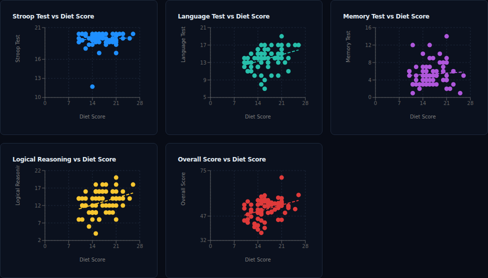

Six scatter plots (one per cognitive metric) show Diet Score on the x-axis against each cognitive outcome on the y-axis. A regression line can be toggled on or off.

---

## 5. Simulator

The Simulator runs the three-stage deterministic pipeline: D→X (Diet → Microbiome), X→M (Microbiome → Metabolites), M→Y (Metabolites → Cognition).


### Diet Input Controls (D)

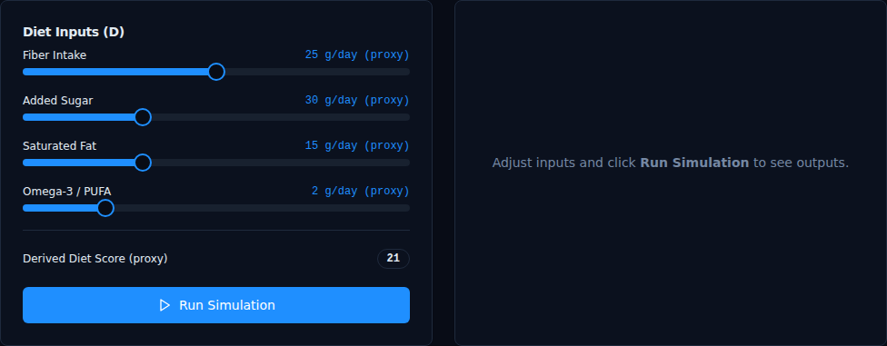

| Input | Range | Default | Biological meaning |
|---|---|---|---|
| **Fiber Intake** | 0–50 g/day | 25 g/day | Dietary fiber from whole grains, legumes, vegetables, fruits |
| **Added Sugar** | 0–100 g/day | 30 g/day | Added sugars from processed foods and beverages |
| **Saturated Fat** | 0–50 g/day | 15 g/day | Saturated fatty acids from animal and processed food sources |
| **Omega-3 / PUFA** | 0–10 g/day | 2 g/day | Omega-3 polyunsaturated fatty acid intake (EPA/DHA proxy) |

A **Derived Diet Score (proxy)** is computed in real time: higher fiber and omega-3 increase the score; higher sugar and saturated fat decrease it. Bounded between 0 and 30.

In normal mode, a collapsible NHANES Reference Ranges panel provides context from the 2021–2022 NHANES codebook. This is UI context only — it does not affect any model computation.

### Running the Simulation

Click **"Run Simulation"** to execute the pipeline. The computation is synchronous and deterministic — the same inputs always produce the same outputs.

### Simulator Results

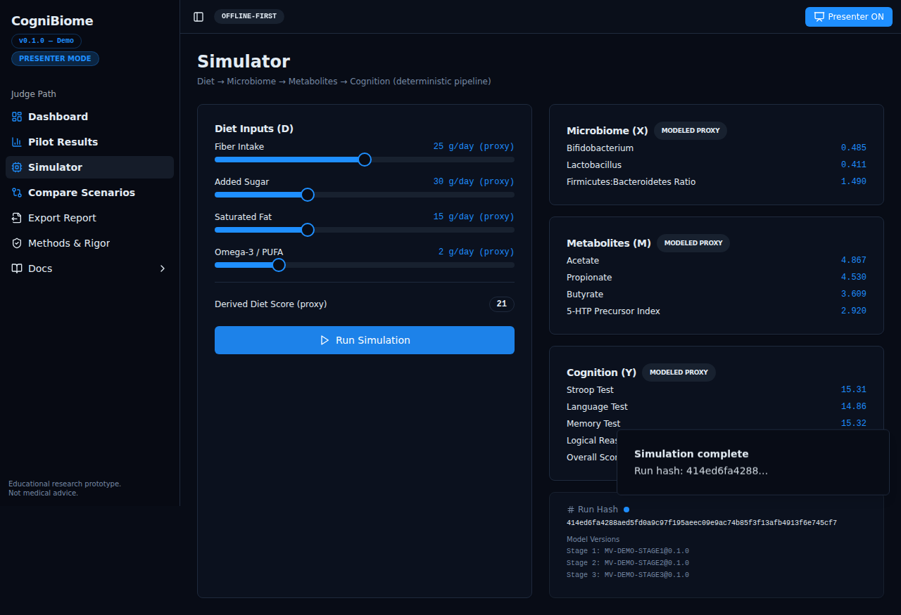

Results appear in three output cards, each labeled **MODELED PROXY**:

**Microbiome (X):**

| Output | Biological meaning |
|---|---|
| **Bifidobacterium** | Relative abundance proxy — beneficial genus associated with fiber fermentation and SCFA production |
| **Lactobacillus** | Relative abundance proxy — probiotic genus associated with gut barrier integrity |
| **Firmicutes:Bacteroidetes Ratio** | Community-level compositional proxy; higher ratios associated with Western-style diets |

**Metabolites (M):**

| Output | Biological meaning |
|---|---|
| **Acetate** | Standardized score proxy for short-chain fatty acid produced by fiber fermentation |
| **Propionate** | Standardized score proxy for SCFA involved in gluconeogenesis and satiety signaling |
| **Butyrate** | Standardized score proxy for SCFA critical for colonocyte energy and anti-inflammatory effects |
| **5-HTP Precursor Index** | Proxy for serotonin precursor availability via tryptophan metabolism — **not** serotonin in the brain |

**Cognitive Outcomes (Y):** Estimated scores for Stroop Test, Language Test, Memory Test, Logical Reasoning, and Overall Score.

### Run Hash and audit trail

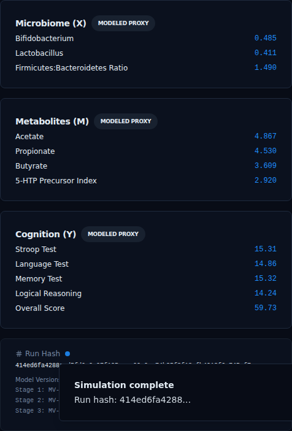

Every completed run is assigned a **Run Hash** — a short hex identifier derived from the input parameters and result values. This ensures reproducibility: the same inputs will produce the same hash. The hash appears in:

- The on-screen result display
- The toast notification after run completion
- The Export Report and Compare Scenarios screens

---

## 6. Methods & Rigor

The Methods & Rigor screen documents the scientific methodology, limitations, data sources, and reference evidence used in the application.

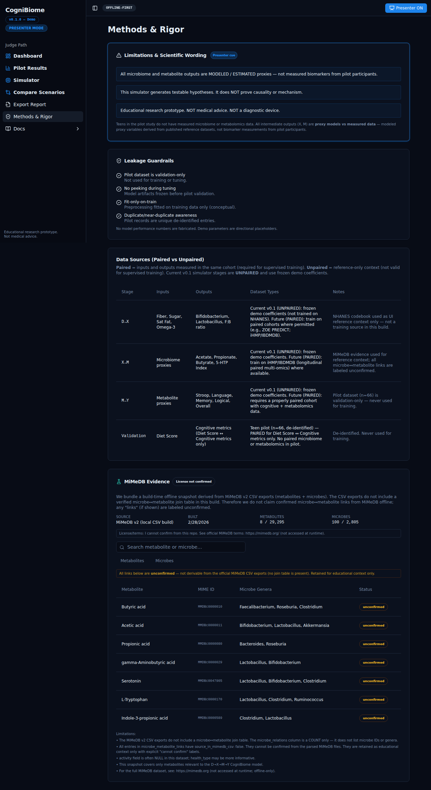

### Limitations & Scientific Wording

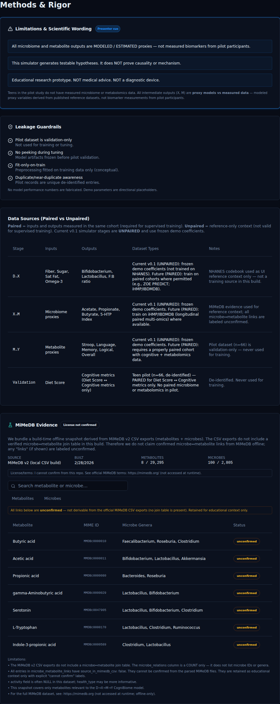

This card — highlighted with a prominent ring in Presenter Mode — contains the three canonical disclaimers:

1. *"All microbiome and metabolite outputs are MODELED / ESTIMATED proxies — not measured biomarkers from pilot participants."*
2. *"This simulator generates testable hypotheses. It does NOT prove causality or mechanism."*
3. *"Educational research prototype. NOT medical advice. NOT a diagnostic device."*

In Presenter Mode, a **"Presenter cue"** badge appears on the card header as a reminder to verbally acknowledge these limitations.

### Leakage Guardrails


| Check | Meaning |
|---|---|
| Pilot dataset is benchmark-only (results-only) | Association charts only; never used to fit or tune simulator demo parameters |
| Demo coefficients are placeholders | Not fit/tuned to pilot results — directional demo parameters only |
| Fit-only-on-train | Preprocessing fitted on training data only (conceptual) |
| Duplicate/near-duplicate awareness | Pilot records are unique de-identified entries |

### Data Sources (Paired vs Unpaired)


| Stage | Definition | Current status |
|---|---|---|
| **D→X** | Diet inputs → Microbiome outputs | **UNPAIRED** — frozen demo coefficients; NHANES used as UI reference context only |
| **X→M** | Microbiome → Metabolite proxies | **UNPAIRED** — frozen demo coefficients; MiMeDB used for reference context |
| **M→Y** | Metabolite proxies → Cognitive outputs | **UNPAIRED** — frozen demo coefficients; pilot dataset is benchmark-only (no metabolomics measured in pilot) |
| **Validation** | Diet Score ↔ Cognitive metrics | **PAIRED** — teen pilot n=66 has both diet scores and cognitive measurements |

> **Key distinction:** "Paired" means inputs and outputs were measured in the same cohort — required for valid supervised training. "Unpaired" means reference data only. All simulator stages in v0.1 are unpaired.

### MiMeDB Evidence


The lower section displays a searchable offline snapshot from **MiMeDB v2 CSV exports** (metabolites + microbes). Three tabs: Metabolites, Microbes, Links.

The CSV exports do not include a microbe↔metabolite join table. Therefore, any link entries in the app are **literature-derived associations** and carry `source_in_mimedb_csv: false`. The UI labels them "unconfirmed" throughout. A "License not confirmed" badge is shown — no license assertion is made for MiMeDB content from within this repo.

---

## 7. Compare Scenarios

The Compare Scenarios screen performs a side-by-side comparison of two previously saved simulation runs.


### Prerequisites

At least two simulation runs must have been saved in the current session. If none exist, the screen shows an empty state with instructions to run the Simulator first.

### Run selectors


Two dropdown menus (Run A and Run B) allow selecting any two saved runs by their hash and timestamp. A **Swap** button reverses the A/B assignment.

### Comparison tables


Three comparison tables, one per pipeline stage: Diet Inputs, Microbiome + Metabolites (MODELED PROXIES), Cognitive Outcomes (MODELED PROXIES).

Delta values are color-coded: green for positive changes, red for negative, grey for no change.

---

## 8. Export Report

The Export Report screen generates a downloadable single-page HTML report summarizing a selected simulation run.

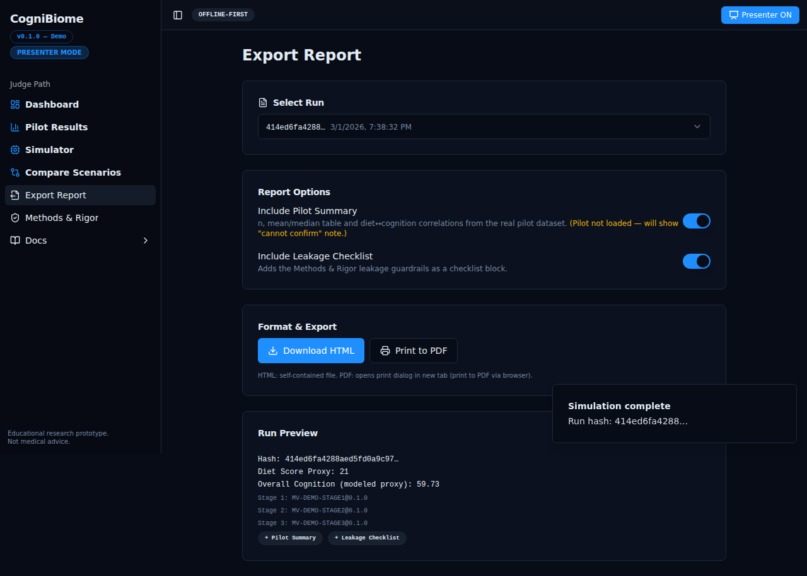

### Selecting a run

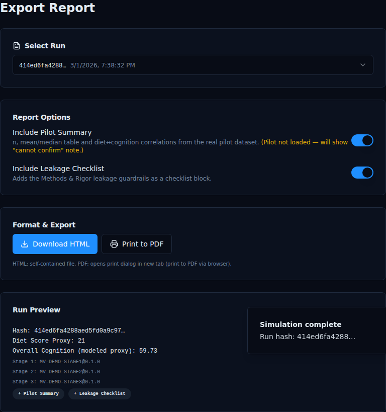

A dropdown lists all saved simulation runs by hash and timestamp.

### Report options

| Option | Description |
|---|---|
| **Include pilot summary** | Appends pilot dataset summary statistics and correlations |
| **Include leakage checklist** | Appends the four leakage guardrail items as a formal methods audit |

### Download controls


The **"Download HTML"** button generates a self-contained HTML file and triggers a browser download. The report includes run metadata, all three MODELED PROXY output sections, and the three canonical disclaimers.

---

## 9. Help / Docs

The Help/Docs screen (sidebar: **Docs**) is an offline documentation viewer.

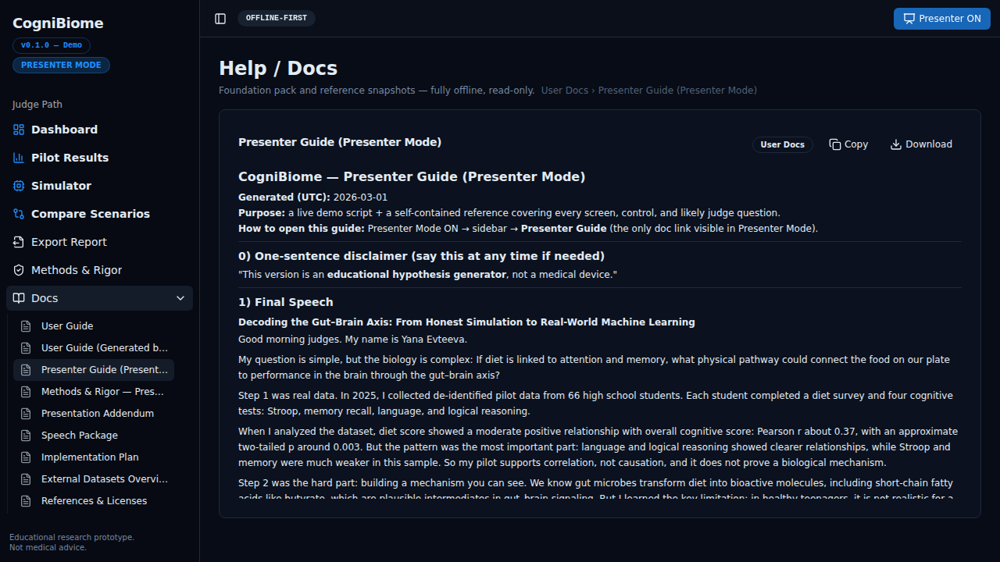

### Sidebar document list


Documents are organized into sections:

- **User Docs** — user-facing guides including this document and the Presenter Pack
- **Trifold Board** — science fair display board content
- **Foundation** — project abstract, plan, requirements, BRD, SRS, and technical specs
- **Data** — pilot dataset CSV, NHANES reference, and external reference snapshots

In **Presenter Mode**, only the User Docs section is shown (without the section header) as a compact flat list.

### Document viewer


Clicking any document title opens it in the main content area. The viewer supports Markdown (with rendered tables and code blocks), JSON, CSV, and plain text.

External links in Markdown documents are rendered as non-navigable styled spans to ensure the app remains fully offline — no live web requests are triggered.

The **Copy** and **Download** buttons allow copying the raw document text or downloading the file.

---

## Appendix: UI Conventions

| Element | Description |
|---|---|
| **REAL DATA** badge (green) | Data shown is from actual measurements — Pilot Results only |
| **MODELED PROXY** badge (grey) | Value is a model estimate, not a measurement — Simulator outputs |
| **Presenter cue** badge (primary) | In Presenter Mode, marks sections to verbally highlight during the demo |
| **Mention in speech** badge (primary) | In Presenter Mode on Pilot Results, marks the top correlations to emphasize |
| **Run Hash** | Short hex identifier for each simulation run — ensures reproducibility |
| **Derived Diet Score (proxy)** | Real-time composite of the four diet sliders — computed by the app, not the model |
| **UNPAIRED** | Pipeline stage uses reference coefficients, not trained on paired cohort data |
| **PAIRED** | Dataset has both inputs and outputs measured in the same cohort |
