# CogniBiome Insights — User Guide (Generated by Cursor)

**Version:** 2.0 — AI-authored from React source + Playwright screenshots  
**Last updated:** March 2026  
**Audience:** Science fair judges, educators, reviewers, and new users

> **Important disclaimer:**  
> CogniBiome Insights is an **educational research prototype**. It is NOT medical advice and NOT a diagnostic device. The simulator generates testable hypotheses — it does not prove causality or mechanism.

---

## Table of Contents

1. [Overview & Application Architecture](#1-overview--application-architecture)
2. [Presenter Mode](#2-presenter-mode)
3. [Dashboard](#3-dashboard)
4. [Pilot Results](#4-pilot-results)
5. [Simulator](#5-simulator)
6. [Methods & Rigor](#6-methods--rigor)
7. [Compare Scenarios](#7-compare-scenarios)
8. [Export Report](#8-export-report)
9. [Help / Docs](#9-help--docs)

---

## 1. Overview & Application Architecture

CogniBiome Insights models the pathway from diet to cognitive performance through two complementary systems:

**Real data (Pilot Results):** A de-identified cohort of 66 teenagers with measured diet scores and cognitive test results. Statistical correlations are computed live from the CSV — nothing is pre-computed or synthetic.

**Modeled pipeline (Simulator):** A deterministic three-stage pipeline that estimates how dietary inputs propagate through the microbiome and metabolite layers to produce cognitive outcome proxies. All intermediate outputs are clearly labeled as **MODELED PROXY** — they are not biomarker measurements.

### The Three-Stage Pipeline

```
D → X → M → Y
```

| Stage | Full name | Inputs | Outputs |
|---|---|---|---|
| D→X | Diet → Microbiome | Fiber, Added Sugar, Saturated Fat, Omega-3 | Bifidobacterium, Lactobacillus, F:B Ratio |
| X→M | Microbiome → Metabolites | Microbiome proxies | Acetate, Propionate, Butyrate, 5-HTP Index |
| M→Y | Metabolites → Cognition | Metabolite proxies | Stroop, Language, Memory, Logical Reasoning, Overall Score |

> **Current build (v0.1):** All three stages use **frozen demo coefficients (UNPAIRED)**. They are directional placeholders — not trained on any paired cohort. Future phases target training on paired multi-omics datasets (ZOE PREDICT, iHMP/IBDMDB).

---

## 2. Presenter Mode

Presenter Mode is a special UI state designed for live demonstrations to judges and reviewers. It simplifies the interface to focus attention on the most scientifically critical elements.

### How to activate

Click the **"Presenter"** button in the top navigation bar. It will change to **"Presenter ON"** and a **"PRESENTER MODE"** badge will appear in the sidebar header.


### What changes in Presenter Mode

| UI element | Normal mode | Presenter Mode |
|---|---|---|
| Sidebar categories | All docs shown with section headers | User Docs only, no section headers, compact list |
| Navigation | All 7 nav items | Judge-path items only (Dashboard, Pilot, Simulator, Compare, Methods, Export) |
| Dashboard | Standard layout | Adds "Demo Sequence — Judge Path" card with ordered steps |
| Pilot Results | All correlations equal weight | Key metrics (Overall Score, Language, Logical Reasoning) highlighted with "Mention in speech" badge |
| Simulator inputs | Sliders + NHANES reference panel + descriptions | Sliders only, descriptions and reference panel hidden |
| Simulator output | All sections | All sections visible |
| Methods & Rigor | Standard layout | Limitations card highlighted with ring, "Presenter cue" badge shown |
| MiMeDB | Opens on Links tab by default | Opens on Metabolites tab by default |

### The REAL DATA badge

Appears in **Pilot Results**. It confirms the data shown is genuine:

```
REAL DATA (de-identified teen pilot, n=66) • computed live from CSV • no synthetic points
```

This badge appears in green regardless of presenter mode, because it applies to the actual pilot dataset — the badge color and prominence are designed to reassure judges that the statistical correlations are real.

### The MODELED PROXY badge

Appears next to every simulator output section header (Microbiome, Metabolites, Cognition). It communicates clearly that these values are **model estimates**, not measurements taken from participants.

```
MODELED PROXY
```

This badge is intentional and transparent — the application never hides the fact that simulator outputs are derived from a model, not from measured biomarkers.

---

## 3. Dashboard

The Dashboard is the entry point and orientation screen. It provides a high-level status overview and navigation to all major sections.


### Status badges

Three small badges appear at the top of the page:

- **Demo Param Set v0** — indicates the current simulator uses v0 frozen demo coefficients
- **Pilot: n=66** — shows that the bundled pilot dataset is loaded (or "not loaded" if it failed)
- **Runs: N** — shows how many simulation runs have been saved in the current browser session

### Judge Path card (Presenter Mode only)


When Presenter Mode is active, a highlighted card appears listing the recommended judge walkthrough sequence:

1. Pilot Results — real n=66 data, correlations
2. Simulator — deterministic diet-to-cognition pipeline
3. Methods & Rigor — disclaimers, data-source table
4. Export Report — auditable run artifact

### Navigation tiles

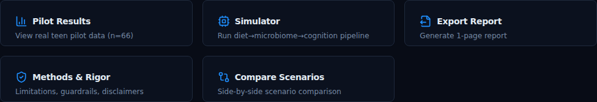

Five clickable cards provide quick navigation to: Pilot Results, Simulator, Export Report, Methods & Rigor, and Compare Scenarios.

### Disclaimer card

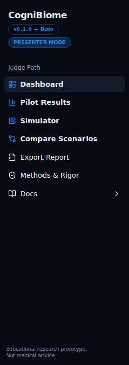

A persistent amber warning card displays the two core disclaimers:

- *"This simulator generates testable hypotheses. It does NOT prove causality or mechanism."*
- *"Educational research prototype. NOT medical advice. NOT a diagnostic device."*

---

## 4. Pilot Results

The Pilot Results screen presents the actual experimental data collected from 66 de-identified teenage participants. This is the only screen in the application showing **real measured data**.

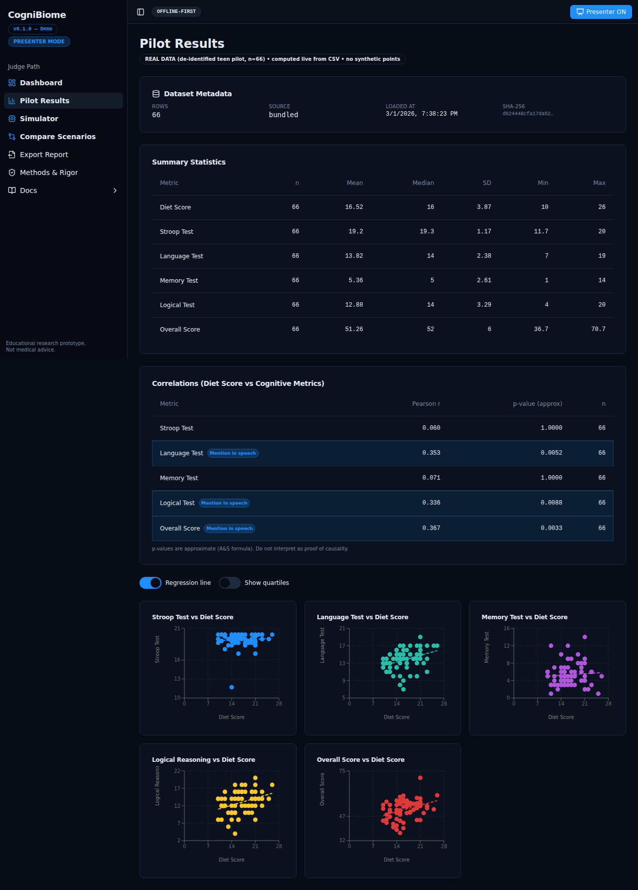

### REAL DATA badge and page header


The green **REAL DATA** badge directly beneath the page title establishes the authenticity of this data at a glance. It specifies:
- The cohort: de-identified teen pilot
- The sample size: n=66
- How values are computed: live from CSV (not pre-calculated)
- Data hygiene: no synthetic points

### Dataset Metadata card


A compact metadata panel shows four data-provenance fields:

| Field | Meaning |
|---|---|
| **Rows** | Number of participant records loaded from the CSV |
| **Source** | `bundled` (the CSV ships with the app) |
| **Loaded At** | Timestamp of when the dataset was parsed in this session |
| **SHA-256** | First 16 characters of the file hash, used for integrity verification |

### Summary Statistics table


A table showing descriptive statistics for each measured variable across all participants:

| Column | Description |
|---|---|
| **Metric** | Variable name (Diet Score, Stroop Test, Language Test, Memory Test, Logical Reasoning, Overall Score) |
| **n** | Number of valid (non-null) values |
| **Mean** | Arithmetic mean |
| **Median** | 50th percentile |
| **SD** | Standard deviation |
| **Min / Max** | Observed range |

### Correlations table

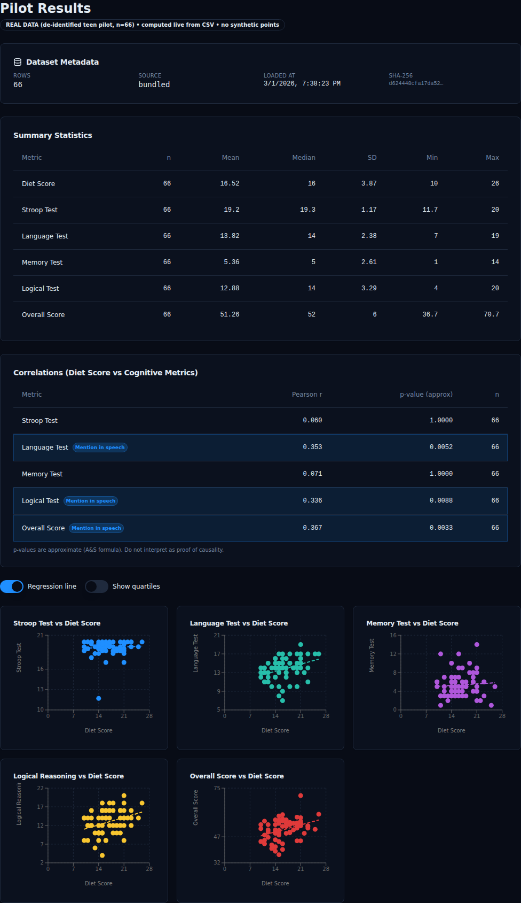

The correlations table quantifies the relationship between Diet Score and each cognitive metric:

| Column | Description |
|---|---|
| **Metric** | Cognitive test name |
| **Pearson r** | Pearson correlation coefficient (−1 to +1) |
| **p-value (approx)** | Approximate two-tailed p-value using the Abramowitz & Stegun formula |
| **n** | Pairwise sample size |

In **Presenter Mode**, three rows are highlighted with a "Mention in speech" badge: Overall Score, Language Test, and Logical Reasoning. These are the correlations most relevant for the judge presentation.

> **Interpretation note:** p-values are approximate and should not be interpreted as proof of causality. The sample size (n=66) is a pilot and not powered for definitive conclusions.

### Scatter plots


Six scatter plots (one per cognitive metric) show Diet Score on the x-axis against each cognitive outcome on the y-axis. A regression line is shown by default and can be toggled off. A quartile overlay can also be enabled.

---

## 5. Simulator

The Simulator screen runs the three-stage deterministic pipeline: D→X (Diet → Microbiome), X→M (Microbiome → Metabolites), M→Y (Metabolites → Cognition).

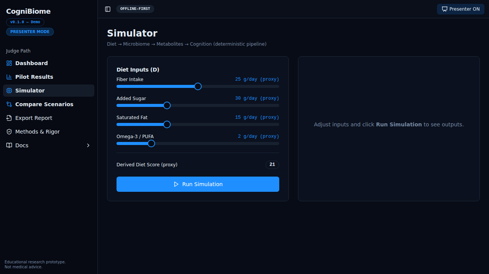

### Diet Input Controls (D)


Four sliders control the dietary input parameters:

| Input | Range | Default | Biological meaning |
|---|---|---|---|
| **Fiber Intake** | 0–50 g/day | 25 g/day | Dietary fiber from whole grains, legumes, vegetables, fruits |
| **Added Sugar** | 0–100 g/day | 30 g/day | Added sugars from processed foods, beverages, desserts |
| **Saturated Fat** | 0–50 g/day | 15 g/day | Saturated fatty acids from animal and processed food sources |
| **Omega-3 / PUFA** | 0–10 g/day | 2 g/day | Omega-3 polyunsaturated fatty acid intake (EPA/DHA proxy) |

A **Derived Diet Score (proxy)** is computed in real time from the slider values using a weighted formula: higher fiber and omega-3 increase the score; higher sugar and saturated fat decrease it. The score is bounded between 0 and 30.

In normal mode, a collapsible NHANES Reference Ranges panel provides context from the 2021–2022 NHANES DR1TOT_L codebook. This is for orientation only and does not affect any model computation.

### Running the Simulation

Click **"Run Simulation"** to execute the pipeline. The computation is synchronous and deterministic — the same inputs always produce the same outputs.

### Simulator Results


Results are displayed in three output cards on the right side of the screen, each labeled with **MODELED PROXY**:

**Microbiome (X):**

| Output | Biological meaning |
|---|---|
| **Bifidobacterium** | Relative abundance proxy — beneficial genus associated with fiber fermentation and SCFA production |
| **Lactobacillus** | Relative abundance proxy — probiotic genus associated with gut barrier integrity |
| **Firmicutes:Bacteroidetes Ratio** | Community-level compositional proxy; higher ratios associated with Western-style diets |

**Metabolites (M):**

| Output | Biological meaning |
|---|---|
| **Acetate** | Standardized score proxy for short-chain fatty acid produced by fiber fermentation |
| **Propionate** | Standardized score proxy for SCFA involved in gluconeogenesis and satiety signaling |
| **Butyrate** | Standardized score proxy for SCFA critical for colonocyte energy and anti-inflammatory effects |
| **5-HTP Precursor Index** | Proxy for serotonin precursor availability via tryptophan metabolism — **not** serotonin in the brain |

**Cognitive Outcomes (Y):**

Estimated scores for Stroop Test, Language Test, Memory Test, Logical Reasoning, and Overall Score.

### Run Hash and audit trail


Every completed run is assigned a **Run Hash** — a short hex identifier derived from the input parameters and result values. This ensures reproducibility: the same inputs will produce the same hash. The hash appears in:
- The on-screen result display
- The toast notification after run completion
- The Export Report and Compare Scenarios screens

---

## 6. Methods & Rigor

The Methods & Rigor screen documents the scientific methodology, limitations, data sources, and reference evidence used in the application.


### Limitations & Scientific Wording


This card — highlighted with a prominent ring in Presenter Mode — contains the three canonical disclaimers:

1. *"All microbiome and metabolite outputs are MODELED / ESTIMATED proxies — not measured biomarkers from pilot participants."*
2. *"This simulator generates testable hypotheses. It does NOT prove causality or mechanism."*
3. *"Educational research prototype. NOT medical advice. NOT a diagnostic device."*

In Presenter Mode, a **"Presenter cue"** badge appears on the card header as a reminder to verbally acknowledge these limitations during the judge presentation.

### Leakage Guardrails


Four green checkmarks confirm the anti-overfitting protections applied:

| Check | Meaning |
|---|---|
| Pilot dataset is validation-only | Not used for training or tuning the model |
| No peeking during tuning | Model artifacts were frozen before pilot validation |
| Fit-only-on-train | Preprocessing fitted on training data only (conceptual) |
| Duplicate/near-duplicate awareness | Pilot records are unique de-identified entries |

### Data Sources (Paired vs Unpaired)


This table is one of the most scientifically important sections. It defines the current status of each pipeline stage:

| Stage | Definition | Current status |
|---|---|---|
| **D→X** | Diet inputs → Microbiome outputs | **UNPAIRED** — frozen demo coefficients; NHANES codebook used as UI reference context only |
| **X→M** | Microbiome → Metabolite proxies | **UNPAIRED** — frozen demo coefficients; MiMeDB used for reference context |
| **M→Y** | Metabolite proxies → Cognitive outputs | **UNPAIRED** — frozen demo coefficients; pilot dataset is validation-only |
| **Validation** | Diet Score ↔ Cognitive metrics | **PAIRED** — teen pilot n=66 has both diet scores and cognitive measurements |

> **Key distinction:** "Paired" means inputs and outputs were measured in the same cohort — required for valid supervised training. "Unpaired" means reference data only, not valid for training. All simulator stages in v0.1 are unpaired.

### MiMeDB Evidence

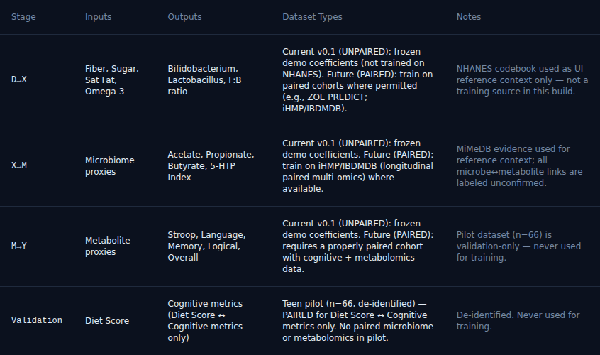

The lower section of Methods & Rigor displays a searchable reference table sourced from the **Microbial Metabolome Database (MiMeDB)**. It contains three tabs:

- **Metabolites** — browse metabolites relevant to the gut-brain axis
- **Microbes** — browse microbial genera and species
- **Links** — browse literature-derived associations between microbes and metabolites

All microbe↔metabolite links carry the annotation `source_in_mimedb_csv: false`, meaning they are literature-derived associations, not confirmed from the MiMeDB CSV join table (which does not exist in the v2 export). The UI labels them **"unconfirmed"** throughout.

The search box filters across all three tabs simultaneously.

> Screenshots from the Methods screen sections are also available in `public/docs/screenshots/`:  
> `methods_data_sources_table.png`, `methods_limitations_and_guardrails.png`, `methods_mimedb_metabolites_tab.png`, `methods_mimedb_microbes_tab.png`

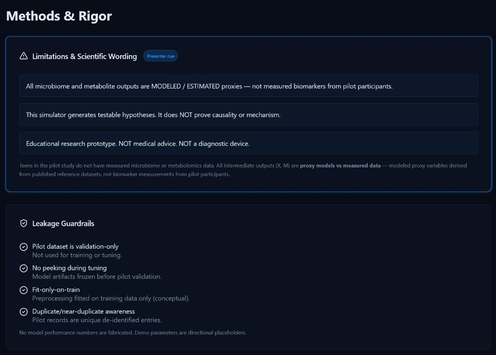

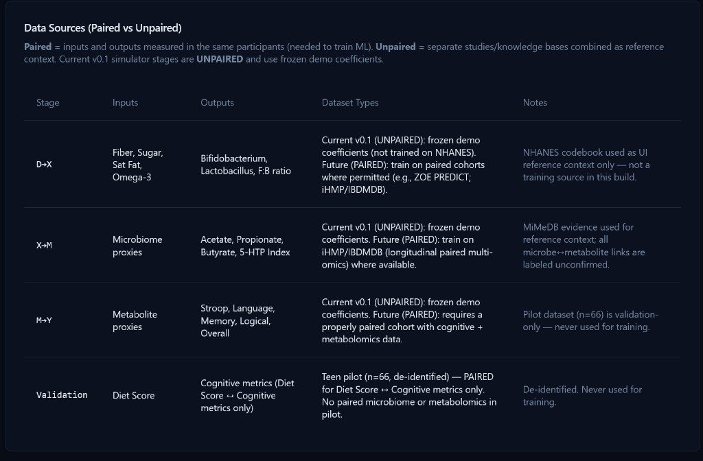

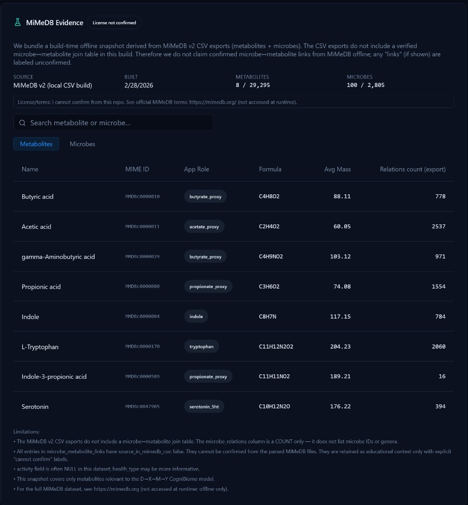

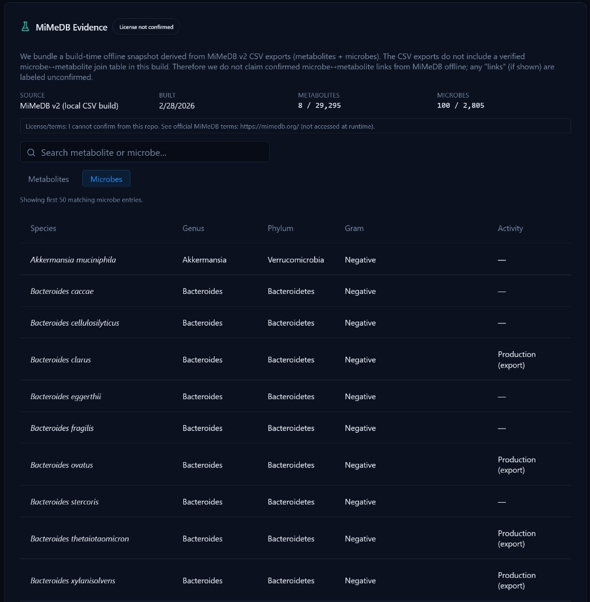

---

## 7. Compare Scenarios

The Compare Scenarios screen performs a side-by-side comparison of two previously saved simulation runs.


### Prerequisites

At least two simulation runs must have been saved in the current session. If no runs exist, the screen shows an empty state with instructions to run the Simulator first.

### Run selectors

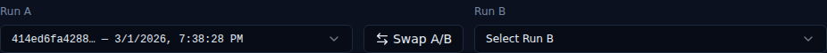

Two dropdown menus (Run A and Run B) allow you to select any two saved runs by their hash identifier and timestamp. A **Swap** button reverses the A/B assignment.

### Comparison tables

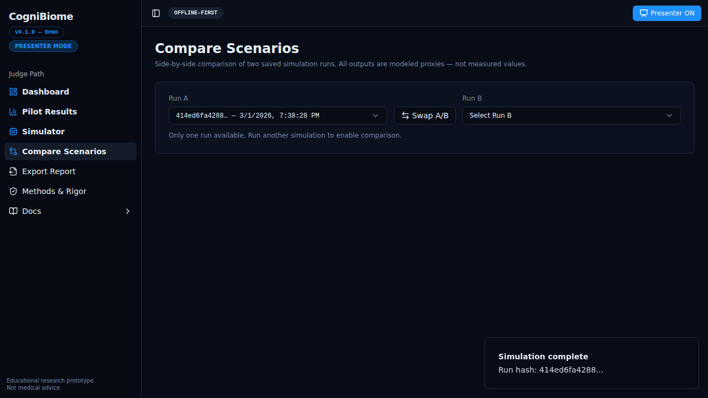

Three comparison tables are displayed, one per pipeline stage:

**Diet Inputs:**
Shows Fiber, Added Sugar, Saturated Fat, and Omega-3 values for both runs plus the absolute and percentage delta (B − A).

**Microbiome + Metabolites (MODELED PROXIES):**
Shows all microbiome and metabolite proxy values with deltas.

**Cognitive Outcomes (MODELED PROXIES):**
Shows the five cognitive scores with deltas.

Delta values are color-coded: green for positive changes, red for negative changes, grey for no change. The heading text "modeled proxies" appears explicitly in this section to maintain the scientific framing that simulator outputs are estimates, not measurements.

---

## 8. Export Report

The Export Report screen generates a downloadable single-page HTML report summarizing a selected simulation run, optionally including pilot summary statistics.


### Selecting a run


A dropdown lists all saved simulation runs by hash and timestamp. Select the run you want to export.

### Report options

Two toggles control what is included in the report:

| Option | Description |
|---|---|
| **Include pilot summary** | Appends pilot dataset summary statistics and correlations to the report |
| **Include leakage checklist** | Appends the four leakage guardrail items as a formal methods audit |

### Download controls


The **"Download HTML"** button generates a self-contained HTML file and triggers a browser download. The report includes:

- Run metadata (hash, timestamp, inputs)
- The three MODELED PROXY output sections (Microbiome, Metabolites, Cognition)
- The three canonical disclaimers
- Optionally: pilot summary stats and leakage checklist

The exported file is offline-readable and formatted for printing or sharing with reviewers.

---

## 9. Help / Docs

The Help/Docs screen (accessible via the **"Docs"** item in the sidebar) is an offline documentation viewer.


### Sidebar document list

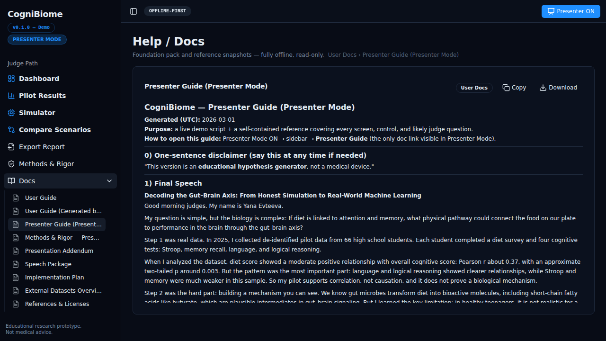

In the sidebar, the "Docs" item expands to show all available documents organized into sections:

- **User Docs** — all user-facing guides including this document
- **Foundation** — project abstract, plan, requirements, BRD, SRS, and technical specs
- **Data** — pilot dataset CSV, NHANES reference, and external reference snapshots

In **Presenter Mode**, only the User Docs section is shown (without the section header) as a compact flat list, removing Foundation and Data entries that are not needed during a live presentation.

### Document viewer

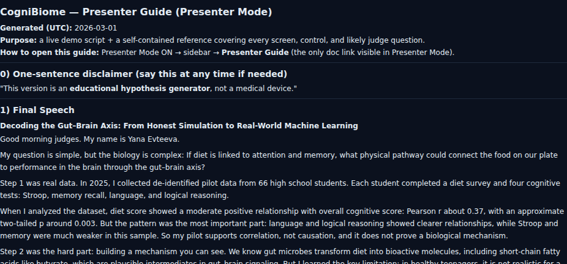

Clicking any document title opens it in the main content area. The viewer supports:

- **Markdown** — rendered with section headings, tables, code blocks, and formatted text
- **JSON** — displayed in a structured tree or object view
- **CSV** — displayed as a scrollable data table
- Plain text

External links in Markdown documents are rendered as non-navigable styled spans to ensure the app remains fully offline — no live web requests are triggered.

The breadcrumb at the top of the content area shows `Category › Document Title`. The **Copy** and **Download** buttons allow copying the raw document text or downloading the file.

---

## Appendix: Keyboard and UI conventions

| Element | Description |
|---|---|
| **REAL DATA** badge (green) | Data shown is from actual measurements — Pilot Results only |
| **MODELED PROXY** badge (grey) | Value is a model estimate, not a measurement — Simulator outputs |
| **Presenter cue** badge (primary) | In Presenter Mode, marks sections to verbally highlight during the demo |
| **Mention in speech** badge (primary) | In Presenter Mode on Pilot Results, marks the top correlations to emphasize |
| **Run Hash** | Short hex identifier for each simulation run — ensures reproducibility |
| **Derived Diet Score (proxy)** | Real-time composite of the four diet sliders — computed by the app, not the model |
| **UNPAIRED** | Pipeline stage uses reference coefficients, not trained on paired cohort data |
| **PAIRED** | Dataset has both inputs and outputs measured in the same cohort |

---

*This guide was generated by Cursor AI from the application's React source code (`src/pages/`, `src/world_model/worldModel.ts`, `src/components/AppSidebar.tsx`) and Playwright E2E screenshots. Screenshots are stored at `e2e/screenshots/` and generated by running:*

```bash
npm run build
npx playwright test e2e/presenterMode.spec.ts
```
